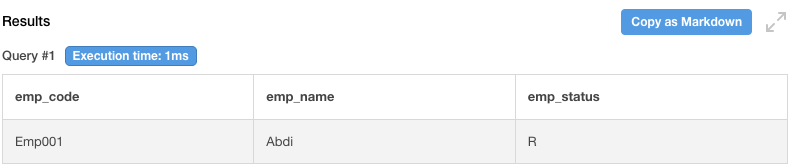

## 1. SQL Table Queries

### a) Query for search employee by name and status ###
```
SELECT * FROM tbl_employee WHERE emp_name='' and emp_status='';

# Example
SELECT * FROM tbl_employee WHERE emp_name='Abdi' and emp_status='R';
```

---

### b) Query for showing name the resigned employee and the salary ###
```
SELECT tbl_employee.emp_name, tbl_income.emp_income, tbl_employee.emp_status
FROM tbl_employee
JOIN tbl_income 
ON tbl_income.emp_code=tbl_employee.emp_code
WHERE tbl_employee.emp_status='R';
```
---

### c) Query for showing emp_code, name, status, income and sort by income descending ###
```
SELECT tbl_employee.emp_code, tbl_employee.emp_name, tbl_income.emp_income, tbl_employee.emp_status
FROM tbl_employee
JOIN tbl_income 
ON tbl_income.emp_code=tbl_employee.emp_code
ORDER BY emp_income DESC;
```
