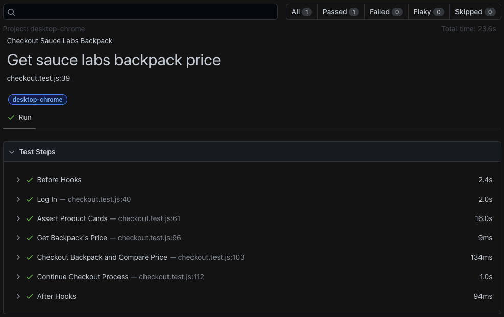

## 2. UI Automation Playwright ##

### How to run: ###
- make sure you have node.js installed
```
npm install

# use standard chrome browser
npx playwright test --project=desktop-chrome

# headless
npx playwright test --project=desktop-chrome --headed
```
### Result: ###


Or you can watch the video [here](https://youtu.be/k6__Hvmx-C8).

---